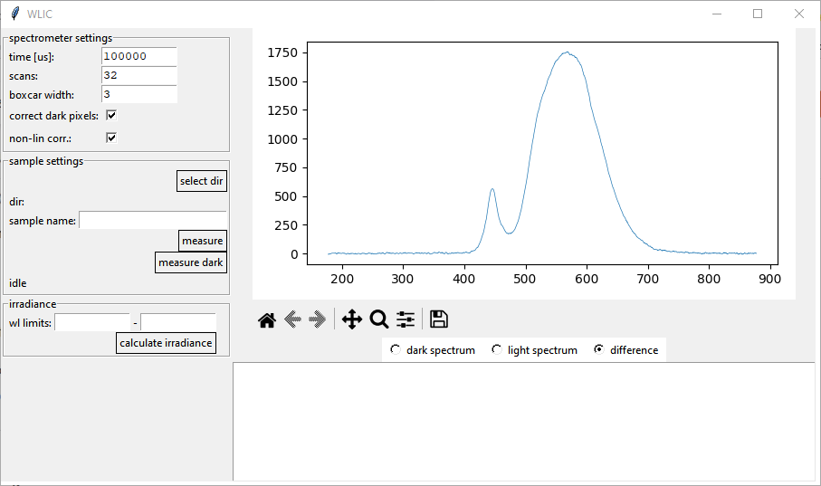

# WaveLength Intensity Collector (WLIC)

## About

A CLI and GUI program for collecting spectra using supported Ocean Optics / Oceran Insight (such as USB2000+) spectrometers.

## Requirements

It requires seabreeze Python package for communication with a spectrometer.

## Use

Run `simple_measure_gui.py` for GUI use.

### Screenshots

### Function reference

`spcomm.py` contains class SpComm for communication with a spectrometer.

#### connectToDevice()
Connects to the first available spectrometer.

#### setIntegrationTime(integrationTime)
Sets the integration time. this function is separated from spectrum collection to allow for time delay. During this time, spectra are collected by the spectrometer (internally) and electric dark correction is calculated.

#### readSpectrumFromDevice(scansToAverage=1, boxcarWidth=0, correctDarkCounts=False, correctNonlinearity=False, callback=None)
Reads the spectra from the device, does the scan averging (if `scansToAverage > 1`) and boxcar averging (if `boxcarWidth > 0`). Returns the spectrum as a dictionary: `{ 'xs', 'ys'}` with `'xs'` containing the wavelengths and `'ys'` the intensities.

## Authorship
Created by Peter Nadrah on 21/12/2022.

## TODO
- CLI interface
- Irradiance measuring support.